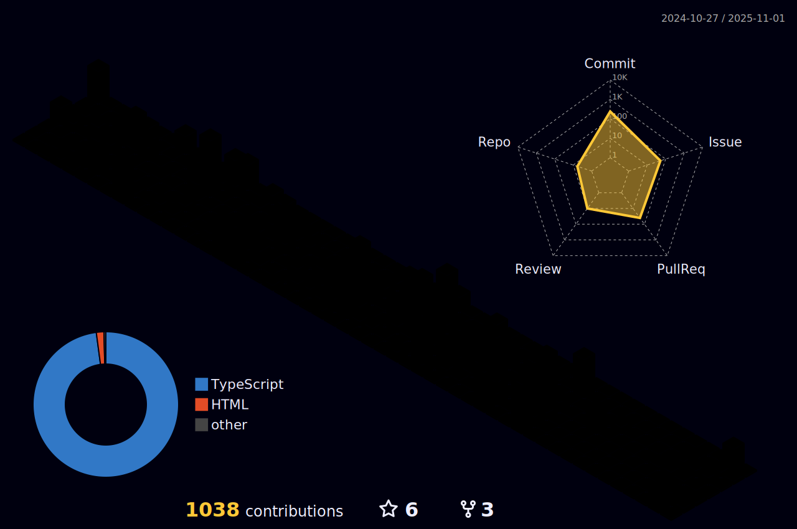

### welcome kazuki1023's repository

 
  
  

<!--
**kazuki1023/kazuki1023** is a ✨ _special_ ✨ repository because its `README.md` (this file) appears on your GitHub profile.

Here are some ideas to get you started:

- 🔭 I’m currently working on ...
- 🌱 I’m currently learning ...
- 👯 I’m looking to collaborate on ...
- 🤔 I’m looking for help with ...
- 💬 Ask me about ...
- 📫 How to reach me: ...
- 😄 Pronouns: ...
- ⚡ Fun fact: ...
-->

### 制作物
#### 就活エージェント比較サイト(就活エージェントSaaS)
- 数ある就活エージェントから自分にあう就活エージェントサイトを選んで申し込みできる。
- 各就活エージェントは、申し込んできた学生情報を閲覧できる
- [リポジトリ](https://github.com/posse-ap/teamdev-2023-posse1-team3C)

- 制作期間：2023/04~06
  - コミュニティ内のチーム開発で作成 
- チームメンバー：４人
- 役割：テックリード

#### テニスサークル紹介SaaS
- こちらは自分がコミュニティ内で自主的に行ったハッカソンのお題です
- 目的としては
1. Laravelのキャッチアップ
2. より同期で仲良くなる

- [リポジトリ](https://github.com/kazuki1023/miniHackathon-template)
